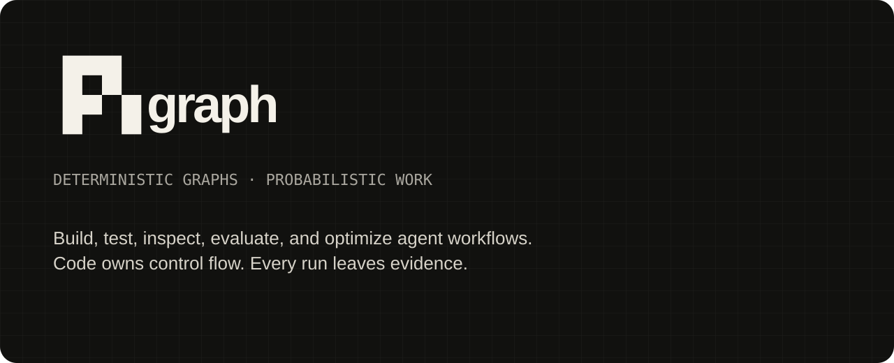
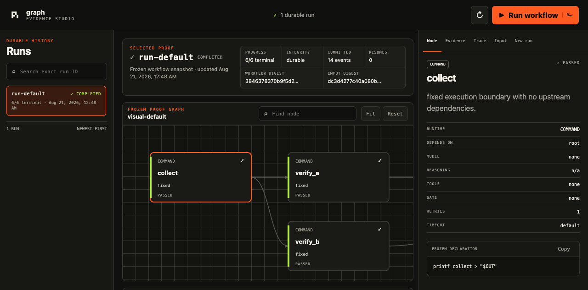

<p align="center">
  
</p>

<p align="center">
  <a href="https://github.com/ali-abassi/pi-graph/actions/workflows/ci.yml"></a>
  <a href="https://github.com/ali-abassi/pi-graph/releases"></a>
  <a href="LICENSE"></a>
</p>

# pi graph

**pi graph gives coding agents a reliable way to create deterministic
workflows that execute every required step and prove what happened.**

Deterministic YAML workflow graphs for coding agents. Your agent authors
`steps.yaml`; from then on code owns order, gates, retries, and budget. The
model does the work inside each node and cannot skip one. Every run leaves
per-node evidence.

`piw` orchestrates. [Pi](https://github.com/earendil-works/pi) — an open-source
CLI coding agent — executes model nodes using the provider account you already
pay for. Shell-only workflows need neither.

## Install

```bash
npm install -g @earendil-works/pi-coding-agent   # model runtime
pi                                                # then /login, pick provider, /exit
git clone https://github.com/ali-abassi/pi-graph.git
cd pi-graph && ./install.sh
piw doctor                                        # installed piw, not ./bin/piw
```

macOS/Linux · Python 3.10+ · Pi 0.80.10+ for model nodes ·
`piw` installs from this clone, not npm · `./install.sh --uninstall` reverses it.

## The loop

```bash
piw create review --action parallel-review              # scaffold a valid graph
piw validate review/steps.yaml                          # free; no model call
piw run review/steps.yaml --input-file task.md
piw resume review/steps.yaml RUN_ID                     # explicit crash recovery
piw detail review/steps.yaml RUN_ID --step parallel-review-verdict --io
piw set review/steps.yaml parallel-review-verdict --model MODEL --thinking low
piw run review/steps.yaml --input-file task.md --node parallel-review-verdict
piw compare review/steps.yaml BASELINE_RUN CANDIDATE_RUN
```

## Optimize workflows deterministically

Agents can improve an existing workflow without owning the experiment state machine. Scaffold a valid contract from the workflow, tune it, then run the bounded loop:

```bash
piw optimize scaffold review/steps.yaml --inputs review/dev.jsonl --holdout /private/holdout.jsonl --json
piw optimize init review/steps.yaml --contract review/optimization-contract.json --out review/optimization/run-001 --json
piw optimize baseline review/optimization/run-001 --json
piw optimize mechanisms review/optimization/run-001 --json
piw optimize checkout review/optimization/run-001 --out /tmp/candidate.yaml --json
# edit exactly one returned mechanism in /tmp/candidate.yaml
piw optimize diff review/optimization/run-001 --file /tmp/candidate.yaml --parent baseline --json
piw optimize submit review/optimization/run-001 --file /tmp/candidate.yaml \
  --parent baseline --hypothesis "Require claim-level evidence" --json
piw optimize status review/optimization/run-001 --json
piw optimize stop review/optimization/run-001 --reason "candidate budget complete" --json
piw optimize promote review/optimization/run-001 --holdout-file /private/holdout.jsonl --json
piw optimize receipt review/optimization/run-001 --json
```

The contract freezes the evaluator, parser, visible corpus, private-holdout digest, model/tool/runtime pins, mutable JSON Pointers, gates, and finite budgets. The baseline uses the exact candidate path; each candidate changes one declared mechanism; rejected candidates are restored byte-for-byte; committed evidence is hash chained and resumable; and the holdout can be reserved once. The controller never invokes commit, push, merge, deploy, or production writes. Workflow nodes still have normal user authority, so use an external sandbox when strict effect isolation is required.

See [Deterministic workflow optimization](docs/optimization.md) and [`schemas/optimization-contract.schema.json`](schemas/optimization-contract.schema.json). Use `piw version --json` to prove the executing source/install identity before paid runs.

## Node kinds

| Kind | Declared by | Behavior |
|---|---|---|
| `command` | `cmd:` | Shell execution. No model, no variance. |
| `llm` | `prompt:` | One isolated completion, no tools or project context. |
| `tool` | `prompt:` + `tools:` | One completion with an explicit tool allowlist. |
| `agent` | `prompt:` + `agent: true` | Full agent loop with normal tools and repo context. |
| `qa` | top-level `qa:` | Independent review after the graph completes. |

Every node takes `gate:` (shell assertion, exit 0 passes), and optionally
`needs:`, `retries:`, `judge:`, `schema:`, `when:`, `produces:`, `timeout:`.

Pin a model as `provider/id` — the first two columns of `pi --list-models`,
joined with a slash. A drifted model **fails the step** rather than silently
answering with another.

**Run `piw schema` for the full contract, or `piw schema --json` for the
machine-readable form.** That is the authoritative reference, not this file.

## Commands

| | |
|---|---|
| `ls` `graph` `schema` `actions` | Inspect what exists |
| `create` `add` `set` `validate` | Author and check, without spending |
| `run` `resume` `batch` `batch-status` `batch-cancel` | Execute and recover |
| `detail` `runs` `show` `compare` `stats` | Evidence after the fact |
| `eval` `reports` | Paired model evidence: regressions, intervals, cost/tokens/latency |
| `optimize …` | Scaffold, checkout/diff/submit, keep/revert, stop, one-time promotion |
| `models` | List valid model ids, or pre-flight one with `--check` |
| `ui` `doctor` `version` `path` | Studio, health, source/install identity, locations |

Every new normal run is a self-contained local bundle: an exact immutable
`workflow.yaml`, SHA-256 workflow/input identity, atomic `manifest.json` and
`state.json` projections, a sequenced `trace.jsonl`, and the existing root
artifacts/ledger/log. A local advisory lock rejects a second writer. If the
runner dies, `piw resume WORKFLOW RUN_ID` verifies the committed boundary and
reruns only unfinished nodes; changed workflow source requires the explicit,
audited `--force-drift`, which executes the reviewed current source while retaining
the original snapshot as evidence. Changed or tampered input is never forceable.
Legacy runs remain readable and support surgical `--from`, but cannot claim a
durable crash boundary. These guarantees target local macOS/Linux filesystems,
not network filesystems or exactly-once external effects.

`--json` on every inspection command. Non-zero exit on failure.

## Studio: the evidence is the visualization

```bash
piw ui review/steps.yaml --input-file task.md
```

Studio is a local evidence workspace over the same canonical runner—not a
second engine. It discovers durable history after restart, renders each run's
**frozen** workflow graph, and synchronizes visible text status, terminal
progress, manifest provenance, committed trace events, and per-node
output/stderr/attempt evidence. Select a run or node, filter the graph and
trace, use keyboard navigation, and copy the exact resume command for an
eligible interrupted run. Legacy and corrupt/incomplete evidence stay visible
as explicitly legacy or degraded; reads never repair or mutate a bundle.

The interface remains usable at `390×844`, bounds run lists, trace events,
files, and responses, and preserves the loopback Host/token defenses. The graph
is still proof—not an editor or browser-side scheduler.

<p align="center">
  
</p>

## Scale

```bash
piw batch steps.yaml --inputs corpus.jsonl --limit 5 --require-all      # canary
piw batch steps.yaml --inputs corpus.jsonl --parallel 16 \
  --require-all --stop-after-failures 3 --max-tokens 2000000 \
  --max-cost 25 --output-step publish --detach --json
```

`--inputs` takes JSONL (`{"content": "...", "id": "optional"}`) or a directory
(one file per item, filename stem becomes `id`). Each item gets an isolated
workspace, attempt directory, event stream, ledger, and receipt. The manifest
pins SHA-256 of workflow and corpus; `--resume` refuses if either changed.
Batch is per-item and never aggregates — combine `outputs.jsonl` with a second
workflow.

## Why not LangGraph, Temporal, or n8n?

They orchestrate **code**; this orchestrates **model calls**. Temporal/Prefect
give durable execution but have no per-node model, judge, or token ledger.
LangGraph/CrewAI are libraries you write agents in — here the graph is a YAML
file an agent authors, validates for free, and is mechanically prevented from
deviating from. n8n/Dify target humans wiring SaaS nodes, not an agent
inspecting and improving a graph from a terminal.

If your steps are deterministic code, use a real orchestrator.

## Reference

| | |
|---|---|
| [`SKILL.md`](SKILL.md) | Operating contract for an agent using this |
| [`docs/workflow-format.md`](docs/workflow-format.md) | Every `steps.yaml` field |
| [`docs/node-system.md`](docs/node-system.md) | Node kinds, gates, routing, QA |
| [`docs/actions.md`](docs/actions.md) | Reusable action templates |
| [`docs/integration-contract.md`](docs/integration-contract.md) | Harness and scheduler integration |
| [`examples/`](examples/) | Runnable workflows, simplest first |
| [`AGENTS.md`](AGENTS.md) | Working inside this repo |

`PI_GRAPH_ROOTS` (discovery paths), `PI_GRAPH_HOME`,
`PI_GRAPH_BIN_DIR`, `PI_GRAPH_PYTHON`, `PI_GRAPH_MODEL`,
`PI_GRAPH_QA_MODEL`.

Workflow ids resolve against the enclosing git project root, this checkout's
`examples/` and `templates/`, and roots registered in `PI_GRAPH_HOME/roots.json`
(override with `PI_GRAPH_ROOTS`). Any workflow positional also accepts a
directory containing `steps.yaml`, or the yaml path itself. With `--json`,
failures emit one `{schema: pi-graph.error.v1}` document on stdout.

## Develop

```bash
python3 -m venv .venv && .venv/bin/python -m pip install -r requirements.txt
npm ci --ignore-scripts
npm run verify          # tests, typecheck, examples, live run, regression guards
```

Workflows execute shell and model calls with your permissions — review
third-party graphs before running them ([`SECURITY.md`](SECURITY.md)).

## License

[MIT](LICENSE) · [`CONTRIBUTING.md`](CONTRIBUTING.md) · [`CHANGELOG.md`](CHANGELOG.md)
